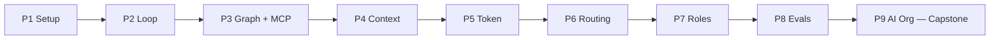

# construct — Roadmap (v2)

**From a first agent loop to a fully automated AI organization — 9 phases · 24 weeks · 5–8 hrs/week.**
End goal: the multi-agent routing architecture of a SaaS ERP, built and understood layer by layer.

> Final merge of the source docx (`AI_Agents_Mastery_Roadmap.docx`, July 2026), the scaffolded repo
> `ROADMAP.md`, and Claude's v2 review fixes. This file is the canonical map — one source of truth for
> sequence, gates, and links; full per-phase study guides live in `phases/XX/README.md`.

## v2 — final (2026-07-26)

The scaffolded repo version had already corrected the source docx's appendix/timeline ordering and added the Mermaid ladder + orientation rationale — both kept here. Changes vs the repo version:

1. **9 phases** — Evals & Observability inserted as P8; capstone becomes P9 (`phases/08-ai-organization` → `phases/09-ai-organization`; create `phases/08-evals-observability`; open its issue).
2. **Phase 1 slimmed** — the LangGraph rebuild and MCP server moved into P3's gate; P1 is raw-Python only. Frees ~2 weeks, honors the roadmap's own raw-first rule.
3. **Security thread** — injection defense, least-privilege tools, and a capstone red-team pass; the security lines in P6–P9 gates are pass criteria, not suggestions.
4. **Per-phase operating sections** (mission · concepts · build gate · pass criteria · pitfalls · top resources) replace the separate docs-library table, so every link has exactly one home and the tables can't drift apart again.
5. **Protocol v2** (owner in the loop) + the `LEARNINGS.md` skeleton.
6. Link fix: Anthropic's multi-agent post canonical URL is `https://www.anthropic.com/engineering/built-multi-agent-research-system` (the repo/docx version pointed at a non-canonical slug).

## Why this sequence

A ladder, not a menu — each phase assumes the one before it works; skipping a rung doesn't save time, it moves the debugging to a later, more expensive phase.

The **loop** comes first because it is the atomic unit: every later structure — supervisor topologies, deep-research agents, org-chart hierarchies — is a composition of loops, and a framework debugged without that mental model is debugged blind. **Graphs** follow because a graph is the loop made explicit, persistent, and inspectable — the value of "a state machine you can checkpoint and rewind" only clicks after you've felt an implicit loop fail. **Context engineering** and **token optimization** travel as a pair — every token technique is a context-window manipulation (caching keeps the prefix stable, compaction decides what to evict) — and both must be solid before agents multiply, because multi-agent architecture is, at heart, a context-isolation strategy. **Routing** is the gateway to multi-agent — supervisor, handoff, and swarm are routing decisions repeated over time — and it's where quality, latency, and the ERP's unit economics meet. **Roles** teach decomposition into non-overlapping, verifiable jobs. **Evals** land immediately before the capstone because an organization multiplies every unmeasured weakness — the harness must exist before the agents multiply. The **AI Organization** comes last: fix the layers bottom-up, then multiply.

## Protocol (v4 — concept tutor mode)

The owner learns concepts from examples; Claude is the hands. The owner is trained as the **architect and auditor** of AI systems — specifying, reading traces, and making design calls — and is never asked to write code. Claude builds and runs everything.

Per phase:

- **Kickoff:** Claude studies the phase guide + resources and opens `phases/XX/LEARNINGS.md` — the lesson log. Concepts are taught in learning order, explained plainly, each tied to the ERP end goal.
- **Every lesson = concept → worked example → your call.** The concept explained in plain language; then a worked example (an annotated trace, a real demo run, an Auto-MB scenario, a case study); then a closing **prediction or decision question** the owner answers before the next lesson. Never a coding task.
- **Demos:** Claude writes and commits each phase's reference artifact under `phases/XX/demo/` — heavily annotated, written to be *read*, not reproduced. The owner runs at most a single command to see it behave, then studies the trace with Claude. The artifact ladder survives: later phases still operate on earlier phases' demos.
- **Decision points** remain: options + tradeoffs + recommendation from Claude; the owner decides; the choice is logged.
- **Understanding gates** replace build gates. A phase is done when the owner, in their own words: **(1) passes the checkpoint quiz** (explain the concepts cold), **(2) makes the phase's design call** — a realistic Auto-MB scenario decided and defended, and **(3) diagnoses a seeded failure from a trace** (Claude breaks the demo; the owner reads the transcript and says what went wrong and why).

`LEARNINGS.md` skeleton (v4):
`## TL;DR (≤10 bullets)` · `## Lessons (L1, L2, … — as taught)` · `## Decisions (who chose what, why)` · `## Gotchas` · `## Diagnoses (owner's trace readings)` · `## Checkpoint quiz (owner's answers)`

**Rules:** a concept is "learned" when you can explain it cold, predict what a trace will do before it runs, and make the design call it implies. The golden rule at every gate is unchanged: **a well-prompted single call beats a workflow, a workflow beats an agent, one agent with good tools usually beats a crew** — complexity must earn its place. The schedule is self-paced (the 24-week map reads as a sequence, not a calendar); the understanding gates are not skippable — a phase closes on demonstrated understanding, not on material covered.

## Prerequisites

Python (functions, async, decorators, venvs, Pydantic) · one LLM API key + chat/streaming/structured-output basics · basic prompt engineering + tool calling · git.
Refresher if needed: DeepLearning.AI *Agentic AI* — https://www.deeplearning.ai/courses/agentic-ai
Read before any agent code: **Building Effective Agents** — https://www.anthropic.com/engineering/building-effective-agents

## 24-week map

| Wks | # | Phase | Folder | Build gate | Issue |
|---|---|---|---|---|---|
| 1–2 | P1 | Setting Up AI Agents | `phases/01-setup` | Pocket Research Agent (raw Python) | #3 |
| 3–5 | P2 | Loop Engineering | `phases/02-loop-engineering` | ReAct → guards → evaluator-optimizer, measured | #2 |
| 6–9 | P3 | Graph Engineering (+ MCP) | `phases/03-graph-engineering` | Support-Triage Agent + P1 rebuild in LangGraph + 1 MCP server | #7 |
| 10–11 | P4 | Context Engineering | `phases/04-context-engineering` | The Context Gauntlet (measured) | #1 |
| 12–13 | P5 | Token Optimization | `phases/05-token-optimization` | Cut the agent's token bill ≥50% | #5 |
| 14–17 | P6 | AI Routing | `phases/06-ai-routing` | ERP Query Router | #8 |
| 18–19 | P7 | Agent Roles Assignment | `phases/07-agent-roles` | Planner→Executor→Reviewer with rejection loop | #6 |
| 20 | P8 | Evals & Observability *(new)* | `phases/08-evals-observability` | Eval harness on the P7 crew | *(open)* |
| 21–24 | P9 | AI Organization (capstone) | `phases/09-ai-organization` | Mini ERP, Inc. | #4 |

---

## P1 — Setting Up AI Agents (wks 1–2)

**Mission:** one well-controlled LLM call → one raw agent loop. No frameworks (LangGraph and MCP now live in P3).

**Concepts:** workflow vs agent — workflows are LLMs orchestrated by predefined code paths, agents direct their own process and tool use in a loop; and when NOT to build an agent · API fundamentals: message roles, temperature, structured output, model-tier cost/latency · tool calling: schema + description quality determines reliability more than anything else — you are prompt-engineering your tools · **the raw loop**: messages in → text or tool call out → execute → append → repeat, with a hard stop (this is the single most important exercise on the roadmap) · the 5 workflow patterns by name (chaining, routing, parallelization, orchestrator-workers, evaluator-optimizer — deep dive in P2) · reliability basics: print every tool call, max iterations, cost awareness.

**Build gate — Pocket Research Agent (~100 lines, no framework):** CLI agent with 3 handwritten tools — `web_search` (Tavily/Serper/DuckDuckGo), `read_notes`/`write_notes` on a local markdown file, `calculator`. System prompt with a citation rule, max 10 iterations, every tool call printed. Task: *"Research the current state of small language models for on-device agents and save a 5-bullet summary with sources."*

**Pass when:** you can rewrite the loop from memory · explain workflow-vs-agent without notes · name a task in the ERP that should stay a workflow.

**Pitfalls:** framework before the loop · agent where one call suffices · vague tool descriptions · no stopping condition.

**Top resources:**
- Anthropic — Building Effective Agents (canonical): https://www.anthropic.com/engineering/building-effective-agents
- Dave Ebbelaar — Building AI Agents in Pure Python: https://www.youtube.com/watch?v=bZzyPscbtI8
- OpenAI — A practical guide to building agents: https://openai.com/business/guides-and-resources/a-practical-guide-to-building-ai-agents/
- OpenAI — Advice for Building Agents (video): https://www.youtube.com/watch?v=js4HRqmsDQE
- Microsoft — AI Agents for Beginners (self-study backbone): https://github.com/microsoft/ai-agents-for-beginners

**X:** @hwchase17 · @AnthropicAI · @OfficialLoganK

## P2 — Loop Engineering (wks 3–5)

**Mission:** make the loop reliable — reasoning traces, guards, self-correction, measured reflection.

**Concepts:** ReAct (Thought → Action → Observation; text-parsing flavor first, then native tool calling — same loop, different wire format) · the tool-call contract: return errors *as observations*, never raise, so the loop self-corrects · retry with forced reflection ("what failed, what one change fixes it") + error classification (backoff on 429/5xx, bail on 401/403/422) · Reflexion: generate → critique against explicit criteria → store the lesson → regenerate (~+quality for ~1.6× tokens; most tasks converge in 2 iterations) · **loop guards, non-negotiable:** max iterations (15–25) with an early-stopping "best answer so far" call · wall-clock + token/cost budgets (context grows quadratically) · stuck detection by fingerprinting tool calls (3 identical = spinning) · human checkpoints before irreversible actions · evaluator-optimizer: generator + critic against explicit acceptance criteria — the bridge to multi-agent QA.

**Build gate — ReAct → Reflection in ~150–200 lines (no framework):** (1) ReAct loop from scratch: ChatBot class, 3 tools (`wikipedia`, `calculate`, `arxiv_search`), regex-matched actions, observation feedback. (2) Add guards: max_turns=10, budgets, trace file; feed it a tool that always errors and watch; add fingerprint stuck-detection + forced reflection before retries. (3) Wrap in evaluator-optimizer (max 3 iterations) and run 10 questions through single-pass vs reflection — record quality delta and token multiplier.

**Pass when:** loop from scratch, from memory · guarded agent survives a deliberately broken tool · you can argue workflow-vs-loop with your own cost/failure numbers · measured quality-vs-token tradeoff in hand.

**Pitfalls:** infinite loops (regex silently failing to match) · quadratic cost growth (a 25-turn agent ≈ 20× one call) · no trace = a slot machine, not an agent.

**Top resources:**
- ReAct paper: https://arxiv.org/abs/2210.03629 · code: https://github.com/ysymyth/ReAct
- Reflexion paper: https://arxiv.org/abs/2303.11366
- Lilian Weng — LLM Powered Autonomous Agents: https://lilianweng.github.io/posts/2023-06-23-agent/
- Steve Kinney — The Anatomy of an Agent Loop (guards): https://stevekinney.com/writing/agent-loops
- 12-Factor Agents: https://github.com/humanlayer/12-factor-agents
- AI Bites — ReAct from scratch (build-gate reference): https://www.ai-bites.net/lets-build-an-ai-agent-from-scratch-in-raw-python/
- Andrew Ng — agentic workflows talk: https://www.youtube.com/watch?v=sal78ACtGTc · Anthropic re:Invent 2025 agent lessons: https://www.youtube.com/watch?v=TledrLrVUQI

**X:** @ShunyuYao12 · @lilianweng · @dexhorthy · @swyx

## P3 — Graph Engineering + MCP (wks 6–9)

**Mission:** reify the loop as an explicit, persistent, inspectable state machine — then standardize its tools.

**Concepts:** typed state + **reducers** (partial updates, `add_messages` — most beginner bugs live here) · conditional edges (routing functions returning the next node — always with a termination condition) · cycles + the super-step model (independent nodes run in parallel) · persistence: checkpointer (thread-scoped: Memory → Sqlite/Postgres) vs Store (cross-thread) · human-in-the-loop interrupts (`interrupt()`, `update_state`, `Command(resume=…)`) — placed immediately before anything irreversible · time travel (fork from a checkpoint, edit state, explore) · streaming + LangSmith tracing · subgraphs (a compiled graph as a node — the foundation for P6/P7 topologies) · LangGraph Studio · framework survey: OpenAI Agents SDK, CrewAI, Claude Agent SDK; AutoGen is maintenance-mode (migrating to Microsoft Agent Framework — learn concepts, don't build on it) · **MCP:** hosts/clients/servers, JSON-RPC over stdio/HTTP, three primitives (tools, resources, prompts) · version note: LangGraph v1.0 (Oct 2025) — expect import drift in older tutorials (`langgraph.prebuilt` → `langchain.agents`).

**Build gate (three parts):** (a) **Rebuild the P1 agent in LangGraph** — StateGraph, checkpointer, one HITL interrupt before `write_notes`, LangSmith trace inspected. (b) **Support-Triage Agent:** classify (conditional edge: refund/technical/other) → draft_reply → quality_check loop (retries ≤ 2) → `interrupt()` for approve/reject-with-feedback/edit → mocked send; SqliteSaver + prove crash-resume by killing the process mid-run; time-travel fork before quality_check; subgraph bonus; Studio screenshot in the README. (c) **Move `web_search` into an MCP server**, register it in Claude Desktop/Code, then connect the same server to the graph.

**Pass when:** all of: correct reducers · routed conditional edges with guaranteed termination · a retry cycle that cannot run away · crash-resume from checkpoint · interrupt/edit/resume · fork from a past checkpoint · a subgraph mounted in a parent · one working MCP server consumed by your own agent.

**Pitfalls:** over-graphing (no conditional edges + no cycles = a chain in LangGraph clothing) · state bloat (store bulky artifacts externally, pass references) · in-memory checkpoints for approvals that span days · cycles without caps.

**Top resources:**
- LangChain Academy — Intro to LangGraph (free, 55 lessons): https://academy.langchain.com/courses/intro-to-langgraph · short version: https://academy.langchain.com/courses/langgraph-essentials-python
- freeCodeCamp — LangGraph Complete Course: https://www.youtube.com/watch?v=jGg_1h0qzaM
- Docs: Graph API https://docs.langchain.com/oss/python/langgraph/graph-api · Persistence https://docs.langchain.com/oss/python/langgraph/persistence · HITL https://docs.langchain.com/oss/python/langchain/human-in-the-loop · Subgraphs https://docs.langchain.com/oss/python/langgraph/use-subgraphs · Time travel https://docs.langchain.com/oss/python/langgraph/use-time-travel
- LangGraph Studio demo: https://www.youtube.com/watch?v=pLPJoFvq4_M · Tech With Tim production-style build: https://www.youtube.com/watch?v=cUC-hyjpNxk
- MCP: https://modelcontextprotocol.io/introduction · reference servers: https://github.com/modelcontextprotocol/servers · why: https://www.anthropic.com/news/model-context-protocol · first-server walkthrough: https://www.deployhq.com/blog/build-your-first-mcp-server-model-context-protocol-guide

**X:** @LangChainAI · @RLanceMartin · @BraceSproul

## P4 — Context Engineering (wks 10–11)

**Mission:** decide what fills the window. The pivot of the whole roadmap — token optimization is applied context engineering, and multi-agent is context isolation at scale.

**Concepts:** the objective function: *the smallest set of high-signal tokens that maximizes the likelihood of the desired outcome* (LLM = CPU, context window = RAM) · failure modes: **context rot** (degradation at every length — there is no safe big window), lost-in-the-middle (U-shaped attention), and poisoning / distraction / confusion / clash · static design: system prompts at the right altitude, stable cacheable prefixes, fewer well-scoped tools; mask tools mid-task instead of removing them · the four pillars — **Write** (scratchpads, todo.md recitation), **Select** (targeted reranked retrieval, just-in-time references over dumping), **Compress** (frequent intentional compaction, ~40–60% utilization), **Isolate** (sub-agents with fresh windows returning 1–2k-token summaries; great for parallel reads, risky for single-author writes) · memory: short-term (thread state) vs long-term (semantic/episodic/procedural), hot-path vs background writes, and *keep errors in* — failure traces are how the model avoids repeating them · KV-cache economics: append-only, no timestamps in prefixes, stable ordering; evaluate at realistic fill levels.

**Build gate — The Context Gauntlet (~150 lines, one evening):** one support agent, two versions, 25+ turn simulated conversation with facts planted at the start and middle, 6–8 tools (two returning bloated JSON). Version A: naive full history. Version B: checkpointed short-term memory + top-3 reranked RAG + rolling summary past 6 turns + tool outputs offloaded to files + long-term fact store (+ stretch: an isolated research sub-agent). **Measure:** 12-question eval, accuracy vs fact position (start/middle/end), tokens and cost per call. Deliverable: one page with both accuracy-vs-context-length curves. Expected: A degrades after ~10 turns; B holds with 50–80% fewer tokens.

**Pass when:** you can map each of the four failures to the pillar that fixes it · your curves show B holding while A degrades · you have personally watched a mid-context fact get missed.

**Pitfalls:** dumping everything in "because the window fits it" · the bigger-window fallacy · deleting error traces · mutating the prefix mid-task (silent cache-buster — quantified in P5).

**Top resources:**
- Anthropic — Effective context engineering for AI agents: https://www.anthropic.com/engineering/effective-context-engineering-for-ai-agents
- Lance Martin — Write/Select/Compress/Isolate: https://rlancemartin.github.io/2025/06/23/context_engineering/
- Manus — production lessons (KV-cache, masking, recitation): https://manus.im/blog/Context-Engineering-for-AI-Agents-Lessons-from-Building-Manus
- Chroma — Context Rot: https://research.trychroma.com/context-rot · Drew Breunig — How Contexts Fail: https://www.dbreunig.com/2025/06/22/how-contexts-fail-and-how-to-fix-them.html
- Runnable examples: https://github.com/langchain-ai/how_to_fix_your_context · Dex's ACE prompts: https://github.com/humanlayer/advanced-context-engineering-for-coding-agents
- Videos: Lance Martin + Peak Ji (Manus): https://www.youtube.com/watch?v=6_BcCthVvb8 · Dex Horthy (YC): https://www.youtube.com/watch?v=IS_y40zY-hc · LangChain: https://www.youtube.com/watch?v=XFCkrYHHfpQ

**X:** @karpathy · @tobi · @_philschmid

## P5 — Token Optimization (wks 12–13)

**Mission:** attack compounding spend in a fixed order — **measure → cache → compress → right-size → structural** — cheapest lever first.

**Concepts:** measurement: tiktoken locally, `usage` on every call — only `cached_tokens > 0` proves a hit; **cache hit rate is the metric** (monitor it like uptime) · prompt caching: Anthropic explicit (`cache_control`, 4 breakpoints, ~0.1× reads / 1.25× writes, 5-min TTL), OpenAI automatic (≥1,024 tokens, `prompt_cache_key`), Gemini implicit + explicit (storage-billed) · cache-safe layout: static decision context first, volatile tail last; never edit the system prompt mid-session (use system-reminder-style messages); don't swap models/tool sets mid-session · compaction tiers: prune tool outputs → truncate reads → summarize last (quality degrades with repeats; externalize durable state to files) · LLMLingua compression (test vs uncompressed baseline; reasoning degrades at aggressive ratios) · tool-output truncation (~1,000-token head+tail cap; prune unused MCP schemas — each server taxes every message) · right-sizing: cheap models for classification/extraction/formatting, flagship for synthesis; a well-cached big model can beat an uncached small one · batch APIs: flat ~50% for async work · output-side savings: tight schemas, brevity instructions, token caps.

**Build gate — "Cut My Agent's Token Bill in Half":** take the P2/P3 agent, 20 fixed benchmark tasks, record baseline, then four measured passes — cache · truncate+compact · right-size (test cheap model on 30 representative inputs first) · structured outputs. Deliverable: before/after table (cost, in/out/cached tokens, iterations, quality) + which lever contributed most. **Gate: ≥50% cost cut, ≤2-point quality drop.** Stretch: batch the nightly summary job.

**Pass when:** `cached_tokens` consistently non-zero across multi-turn runs · ≥50% cut proven · you can name the biggest lever with numbers.

**Pitfalls:** cache-busting layouts (one timestamp near the top) · premature compression · right-sizing without testing · retrofitting cache-awareness late (it's architecture, not a bolt-on).

**Top resources:**
- Anthropic prompt caching: https://docs.anthropic.com/en/docs/build-with-claude/prompt-caching · OpenAI: https://developers.openai.com/api/docs/guides/prompt-caching + https://developers.openai.com/cookbook/examples/prompt_caching_201 · Gemini: https://ai.google.dev/gemini-api/docs/caching
- Claude Code context window (compaction reference): https://code.claude.com/docs/en/context-window
- tiktoken: https://github.com/openai/tiktoken · LLMLingua: https://github.com/microsoft/LLMLingua
- "Prompt Caching Is Everything" write-up: https://blog.devaubree.fr/en/blog/prompt-caching-claude-code/ · cross-provider study (45–80% cuts): https://arxiv.org/abs/2601.06007
- Videos: Nate Herk (10-min habits): https://www.youtube.com/watch?v=6cEQEba0i2A · IBM caching mechanics: https://www.youtube.com/watch?v=u57EnkQaUTY

**X:** @trq212 (thread: https://x.com/trq212/status/2024574133011673516) · @bcherny · @simonw

## P6 — AI Routing (wks 14–17)

**Mission:** decide *who answers each request* — model routing (cheapest capable model) and task/agent routing (right specialist). The gateway to multi-agent, and where quality, latency, and SaaS unit economics meet.

**Concepts:** semantic/intent routing: one route per intent, 8–10 example utterances, cosine similarity + confidence threshold, ~100ms and near-free; explicit fallback (LLM tiebreaker or human) · rule-based routing: keywords/regex/request features — wins when logic must be auditable (tenant tiers, permissions), fails on nuance · LLM-based routing: structured-output classifier / function-calling dispatcher — handles ambiguity, costs a call per request · cost-aware model routing: RouteLLM-style routers, threshold calibrated on *your* traffic, router overhead < ~50ms, cascade patterns; gateways (OpenRouter auto-router, fallbacks) · handoffs & orchestration: supervisor (central delegator) vs swarm (peer `transfer_to_*` tools, `active_agent` in state); handoff payload discipline — explicit schemas, token budgets at boundaries, validation, bounded retries, transition logging.

**Build gate — the ERP Query Router (1–2 weekends; this is a product prototype):**
user query → semantic-router (finance | inventory | hr | sales | chitchat | out_of_scope; local FastEmbed encoder; <threshold → cheap-LLM tiebreaker) → LangGraph supervisor with `transfer_to_<dept>` handoff tools → 4 specialists with 2–3 mock ERP tools each (`get_invoice`, `check_stock`, `get_leave_balance`) → per-agent model routing (RouteLLM strong/weak pair or OpenRouter fallback array, threshold calibrated on ~50 of your own queries) → every decision logged (query, intent, confidence, agent, model, tokens, cost, latency).
**Eval:** 60 labeled queries — intent accuracy, misroute rate, cost/query vs an all-strong baseline (expect 40–70% savings), p95 latency, written failure-mode analysis. Compare supervisor vs swarm for debuggability. Stretch: shadow mode, per-tenant rules, human escalation route.
**Security (required):** an explicit injection/out-of-scope route; per-specialist tool allow-lists; instruction-bearing user input gets logged and refused, never forwarded to a specialist.

**Pass when:** you can state model-vs-agent routing and where each lives in the ERP · semantic router with thresholds + fallback, latency measured · RouteLLM threshold calibrated with per-segment quality checks · clean handoff payloads with logging · eval numbers + failure analysis in the repo.

**Pitfalls:** the router as a single point of failure (rule fallbacks, timeouts, default generalist route) · miscalibrated thresholds silently sending everything to the strong model (watch the strong/weak split as a first-class metric) · shipping a classifier with no labeled eval set.

**Top resources:**
- RouteLLM: https://github.com/lm-sys/routellm · paper: https://arxiv.org/abs/2406.18665
- semantic-router: https://github.com/aurelio-labs/semantic-router · docs: https://docs.aurelio.ai/semantic-router/get-started/introduction
- LangChain multi-agent + handoffs: https://docs.langchain.com/oss/python/langchain/multi-agent · https://docs.langchain.com/oss/python/langchain/multi-agent/handoffs · supervisor lib: https://reference.langchain.com/python/langgraph-supervisor
- OpenRouter auto-router: https://openrouter.ai/docs/guides/routing/routers/auto-router
- ERP-relevant production sketch (pgvector + semantic-router + MCP): https://truto.one/blog/how-to-implement-semantic-routing-for-ai-agents-to-select-api-endpoints/
- Videos: multi-agent handoffs: https://www.youtube.com/watch?v=WTr6mHTw5cM · hierarchical supervisor: https://www.youtube.com/watch?v=B_0TNuYi56w · James Briggs semantic router: https://www.youtube.com/watch?v=ro312jDqAh0 · RouteLLM walkthrough: https://www.youtube.com/watch?v=-0C35d8ZtwA

**X:** @OpenRouterAI · @jamescalam

## P7 — Agent Roles Assignment (wks 18–19)

**Mission:** split one agent into a team of specialists — after proving one agent actually fails. Restraint first: role-based systems commonly cost 3–5× in tokens.

**Concepts:** the single-vs-multi ledger — split only on trace evidence of failure, or for hard role/tool boundaries (the finance agent must never see HR tools) · the role vocabulary: planner / researcher / executor / reviewer / orchestrator — map a business process onto it on paper first · role–goal–backstory design (specific professional archetypes, outcome goals with success criteria; `agents.yaml`/`tasks.yaml` keep definitions out of code) · decomposition without overlap: narrow job, narrow toolset, distinct output artifact, independently verifiable; overlapping backstories break skill-based routing · sequential crews as the default (deterministic, cheap) · delegation & handoffs: who may delegate, loop prevention (workers `allow_delegation=False`, capped depth), what context travels · supervisor/hierarchical (manager validates and re-assigns; earn hierarchy last) · reviewer loops & guardrails: binary APPROVED/REJECTED contracts, validation functions with capped retries, `human_input` at judgment points · per-role model sizing: strong manager/reviewer, cheap workers — routing economics meets team design.

**Build gate — Planner → Executor → Reviewer with a rejection loop (CrewAI):** three agents; the reviewer has *no* writing tools and a binary output contract. Seed a trap (require "a cited statistic per section" on a topic where statistics are scarce), watch the reviewer reject with numbered violations, close the loop via a guardrail retry (≤2), and run the same prompt through a single-agent baseline to see what it ships silently. Stretch: hierarchical variant with a custom manager; compare cost/latency/trace clarity. ERP variant: a monthly-close-report crew verifying every figure against mock ERP data.
**Security (required):** the reviewer also scans tool outputs for injected instructions; every worker gets a least-privilege toolset.

**Pass when:** roles mapped on paper before code · mutually exclusive YAML role definitions · delegation rules + loop prevention explained · traces showing the seeded error caught and reworked · an evidence-based answer to "was the crew better than one good agent?"

**Pitfalls:** role overlap (interchangeable backstories) · agents arguing in circles (delegation everywhere, no termination) · cost blowup with no single-agent baseline to compare against.

**Top resources:**
- CrewAI — Crafting Effective Agents: https://docs.crewai.com/v1.15.2/en/guides/agents/crafting-effective-agents · Hierarchical Process: https://docs.crewai.com/v1.15.2/en/learn/hierarchical-process · examples: https://github.com/crewAIInc/crewAI-examples
- LangGraph supervisor tutorial: https://langchain-ai.github.io/langgraph/tutorials/multi_agent/agent_supervisor
- DeepLearning.AI — Multi AI Agent Systems with crewAI: https://www.deeplearning.ai/courses/multi-ai-agent-systems-with-crewai · follow-up: https://www.deeplearning.ai/short-courses/practical-multi-ai-agents-and-advanced-use-cases-with-crewai/
- When hierarchy earns its keep: https://activewizards.com/blog/hierarchical-ai-agents-a-guide-to-crewai-delegation/ · single-vs-multi decision framework: https://learn.microsoft.com/en-us/azure/cloud-adoption-framework/ai-agents/single-agent-multiple-agents
- Videos: CrewAI crash course: https://www.youtube.com/watch?v=UV81LAb3x2g · per-role model sizing build: https://www.youtube.com/watch?v=QfxwVgUew8c · YAML project layout: https://www.youtube.com/watch?v=K2UAE1OlC8s

**X:** @joaomdmoura · @crewAIInc · @omarsar0

## P8 — Evals & Observability (wk 20) *(new in v2)*

**Mission:** every gate so far demanded measurement — formalize it before the capstone multiplies agents. One loopy agent is annoying; twenty are a budget incident you can't see.

**Concepts:** eval-set construction: scripted scenarios with expected outcomes and labeled difficulty, built from real failure cases · exact-match vs LLM-as-judge: rubric scoring (factual accuracy, criteria compliance, source quality, tool efficiency) — judge the **end state, not the path**, because multi-agent runs are non-deterministic by design · judge calibration: score 20 samples yourself first, then check judge agreement · tracing: LangSmith/Langfuse, one shared trace ID across every agent in a run (OpenTelemetry) so an org run is one story · per-agent cost/latency dashboards · the regression harness: run the eval set after *any* prompt or topology change — otherwise every tweak is a coin flip · benchmark literacy: when quoting SWE-bench/AutoGenBench numbers, always name the split, scaffold, and date.

**Build gate — eval harness on the P7 crew:** 15–20 scripted scenarios with expected outcomes · LLM-as-judge rubric + exact-match where possible · judge calibrated against 20 hand-labeled samples · full tracing with per-agent cost dashboard · then **prove it**: deliberately weaken one prompt and show the harness catches the regression before you do.

**Pass when:** the harness flags the seeded regression · judge agreement with your labels is measured · one command re-runs the whole suite and posts a scoreboard.

**Pitfalls:** vibes-based judging (no rubric, no calibration) · path-based evals on non-deterministic systems · building the harness after the org exists instead of before.

**Top resources:**
- Agent evaluation (video): https://www.youtube.com/watch?v=rh_PcL26zls
- Langfuse — AI agent observability: https://langfuse.com/blog/2024-07-ai-agent-observability-with-langfuse
- LangSmith courses (evals, deployment) via LangChain Academy: https://academy.langchain.com/
- Anthropic — multi-agent research system (LLM-judge rubric + end-state evaluation lessons): https://www.anthropic.com/engineering/built-multi-agent-research-system

**X:** @simonw · @omarsar0

## P9 — AI Organization: "Mini ERP, Inc." (wks 21–24, capstone)

**Mission:** a multi-agent system designed like a company — org chart, task board, SOPs as artifacts, humans approving only at defined gates. Comes last because org scale multiplies every lower-layer weakness.

**Landmarks (history lessons, not starting points):** BabyAGI (~140-line task loop) · AutoGPT (the autonomy wave) · ChatDev (org-chart-as-chat-chain) · **MetaGPT** (the pivotal idea: agents exchange SOP *documents* — PRD → design → tasks → code → tests — not free chat; auditable, less error compounding) · OpenAI Swarm (deprecated; read for the handoff pattern only) · **Magentic-One** (Orchestrator with a Task Ledger + Progress Ledger, re-planning on failure — steal this) · Devin (PRs as the unit of work; humans review artifacts, not keystrokes).

**Stages:** A — the employee (single agent, review territory) → B — the department (roles, communication patterns, structured handoff artifacts) → C — the company (manager/worker delegation with ledgers, recursive decomposition, long-horizon work, interop: MCP for tools, A2A/Agent Protocol between agents) → D — the governed enterprise (approval gates at decision boundaries, RBAC, audit trails, org-scale tracing and evals, reliability engineering, token budgets per department).

**Build gate — Mini ERP, Inc.:** automate one complete workflow ("process a new customer order" or "produce the weekly ops report") end-to-end.
- **Tier 1 — CEO orchestrator:** decomposes the objective, writes tasks to a shared board (SQLite/Postgres), maintains Task + Progress Ledgers, re-plans on failure.
- **Tier 2 — 3 department managers** (Sales, Finance, Operations): claim tasks, delegate, validate worker output before marking complete.
- **Tier 3 — workers:** single-loop agents, one narrow tool-job each (CRM lookup, invoice PDF, email sender, SQL, web search).
- **Required org features:** all inter-agent communication through task-board artifacts (never free chat) · two human gates — plan sign-off before execution, and approval on every external side effect · full tracing with one shared trace ID + per-department cost dashboards · the P8 regression harness on 5 scripted scenarios · token budgets per department, max iterations per worker, and a kill-switch that halts the org and escalates.
- **Security (required):** a red-team pass — seed an injected instruction inside an inbound email / tool result and prove the org refuses, logs, and escalates · secrets live in env/config, never in prompts · per-department tool allow-lists · audit-log review as part of the gate.
- **Stretch:** one department swapped behind an Agent Protocol REST interface · a "hiring" mechanism (CEO instantiates a worker from a template) · cost-per-order vs a single-agent baseline.

**Pitfalls:** automating before evals exist · governance bolted on afterward · recursive delegation loops (cap depth, make human escalation a terminal state) · more agents instead of better agents — fewer, well-instrumented agents with single-threaded writes beat sprawling swarms.

**Top resources:**
- Repos: BabyAGI https://github.com/yoheinakajima/babyagi (+ https://github.com/yoheinakajima/babyagi-2o) · ChatDev https://github.com/OpenBMB/ChatDev (paper: https://aclanthology.org/2024.acl-long.810/) · MetaGPT https://github.com/FoundationAgents/MetaGPT · AutoGPT https://github.com/Significant-Gravitas/AutoGPT · Swarm (read-only) https://github.com/openai/swarm
- Magentic-One (ledger pattern): https://www.microsoft.com/en-us/research/articles/magentic-one-a-generalist-multi-agent-system-for-solving-complex-tasks/
- Agent Protocol: https://agentprotocol.ai/ · Cognition blog ("what's actually working" in multi-agent): https://cognition.com/blog · Devin launch: https://www.cognition.ai/blog/introducing-devin
- MetaGPT explained: https://www.ibm.com/think/topics/metagpt · Langfuse org-scale tracing: https://langfuse.com/blog/2024-07-ai-agent-observability-with-langfuse
- Videos: MetaGPT hands-on: https://www.youtube.com/watch?v=q16Gi9pTG_M · BabyAGI teardown: https://www.youtube.com/watch?v=QBcDLSE2ERA · multi-agent topologies: https://www.youtube.com/watch?v=sWH0T4Zez6I

**X:** @yoheinakajima · @MetaGPT_ · @cognition_labs

---

## Definition of done (roadmap mastery)

You can take a real business process and, end to end: **design** the org (departments, roles, SOP artifacts — knowing when a workflow suffices) · **route** work through it (ledgers, task board, terminating recursion) · **budget** it (right-sized models, per-department token budgets, a quotable cost-per-order) · **observe** it (one trace ID per run, regressions caught before customers) · **govern** it (approvals at exactly the right boundaries, audit trails, a kill-switch everyone trusts). When Mini ERP, Inc. passes its five scenarios under budget with both gates holding, the skeleton of the actual product exists.

## Appendix A — Who to follow on X (v2 phase numbers)

| Handle | URL | Why follow | Phase |
|---|---|---|---|
| @hwchase17 | https://x.com/hwchase17 | LangChain/LangGraph founder & CEO; framework releases, agent architecture, context engineering takes | P1 |
| @AnthropicAI | https://x.com/AnthropicAI | Agent SDK / Claude Code releases, MCP news, engineering blog links | P1 |
| @OfficialLoganK | https://x.com/OfficialLoganK | Leads Google AI Studio/Gemini API (ex-OpenAI DevRel); insider view of agent tooling shifts | P1 |
| @steipete | https://x.com/steipete | Open-source agentic builder (now at OpenAI); candid agentic-engineering workflows | P1 |
| @ShunyuYao12 | https://x.com/ShunyuYao12 | Author of ReAct; co-author of Reflexion, Tree of Thoughts, SWE-bench | P2 |
| @lilianweng | https://x.com/lilianweng | Author of the canonical "LLM Powered Autonomous Agents" survey | P2 |
| @swyx | https://x.com/swyx | Latent Space editor; "AI Engineer" movement; meta-feed for agent discourse | P2 |
| @AndrewYNg | https://x.com/AndrewYNg | DeepLearning.AI course announcements; frames agent design patterns for learners | P2 |
| @dexhorthy | https://x.com/dexhorthy | HumanLayer founder; 12-Factor Agents; loop guards, compaction, RPI loops | P2, P4 |
| @LangChainAI | https://x.com/LangChainAI | Official announcements: LangGraph 1.0, Studio, Academy courses | P3 |
| @BraceSproul | https://x.com/BraceSproul | LangChain engineer; LangGraph-adjacent OSS, agent frontends | P3 |
| @RLanceMartin | https://x.com/RLanceMartin | LangChain engineer; LangGraph course lead; Write/Select/Compress/Isolate taxonomy | P3–P4 |
| @karpathy | https://x.com/karpathy | Coined the canonical "context engineering" definition; LLM-as-OS mental model | P4 |
| @tobi | https://x.com/tobi | Shopify CEO; made "context engineering" mainstream | P4 |
| @_philschmid | https://x.com/_philschmid | Google DeepMind; practical context-engineering threads | P4 |
| @trq212 | https://x.com/trq212 | Claude Code team; "Prompt Caching Is Everything" thread (https://x.com/trq212/status/2024574133011673516) — primary source on token economics | P5 |
| @bcherny | https://x.com/bcherny | Creator/head of Claude Code; context/token-efficiency setup threads | P5 |
| @simonw | https://x.com/simonw | Annotated the caching lessons; relentless practical LLM experiments | P5, P8 |
| @nummanali | https://x.com/nummanali/status/2010042788566720955 | Viral compaction-survival workflow (Plan Mode + persistent to-do list) | P5 |
| @OpenRouterAI | https://x.com/OpenRouterAI | Model catalog, auto-router, provider routing, fallback features | P6 |
| @jamescalam | https://x.com/jamescalam | Aurelio AI founder; creator of the `semantic-router` library | P6 |
| @shao__meng | https://x.com/shao__meng/status/1811187309116895402 | Canonical Mixture-of-Models routing explainer thread | P6 |
| @joaomdmoura | https://x.com/joaomdmoura | CrewAI founder/CEO; role/delegation design, enterprise multi-agent case studies | P7 |
| @crewAIInc | https://x.com/crewAIInc | Official CrewAI account; releases, example crews, hierarchical processes | P7 |
| @pyautogen | https://x.com/pyautogen | Official AutoGen account; Agent Framework migration news | P7 |
| @omarsar0 | https://x.com/omarsar0 | DAIR.AI founder; "AI Agents Weekly"; orchestration paper curation | P7, P8 |
| @yoheinakajima | https://x.com/yoheinakajima | BabyAGI creator; 120+ public agent builds; the autonomous-business mindset | P9 |
| @MetaGPT_ | https://x.com/MetaGPT_ | Official MetaGPT account; multi-agent SOP workflow demos and research | P9 |
| @cognition_labs | https://x.com/cognition_labs | Makers of Devin; org-scale multi-agent lessons ("Devin can now manage Devins") | P9 |

## Appendix B — YouTube channels worth subscribing to

| Channel | Best for |
|---|---|
| freeCodeCamp.org | Long-form free courses (the 3-hour LangGraph course) |
| LangChain | Official LangGraph/handoffs/context-engineering videos and Academy intros |
| Anthropic | Official agent-building guidance ("Vibe coding in prod", "Tips for building AI agents") |
| OpenAI | "Advice for Building Agents" and SDK guidance |
| DeepLearning.AI | Andrew Ng's agentic-design-pattern courses and talks |
| IBM Technology | Vendor-neutral multi-agent and prompt-caching explainers |
| Krish Naik | Long crash courses: LangGraph + MCP, CrewAI, AutoGen (see Appendix C for unlinked titles) |
| Matthew Berman | Agent-framework walkthroughs (MetaGPT) and agent evaluation |
| Dave Ebbelaar | Building agents in pure Python before frameworks |
| James Briggs | Semantic routing and the Aurelio `semantic-router` course playlist |
| Tech With Tim | Production-style LangGraph agent builds with live search |
| CodingDeft | Short, current CrewAI tutorials with YAML project layout |
| Sam Witteveen | Code-level teardowns (BabyAGI, Magentic-One) |
| Sequoia Capital | Andrew Ng's classic "AI agentic workflows" talk |
| Latent Space | Podcast deep dives (Lance Martin on context engineering) |
| YC Root Access | Dex Horthy's advanced context engineering talk |
| Simplilearn | Beginner CrewAI workflow tutorials |
| Probably Private | RouteLLM cost-routing walkthroughs |
| Nate Herk \| AI Automation | Claude/Claude Code token-saving habits |
| Tyler AI | ChatDev virtual-software-company builds |

## Appendix C — unverified links & deprecation notes

Search YouTube by title (no verified watch URL captured): "Agentic AI with LangGraph and MCP Crash Course – Part 1" (Krish Naik) · "The Ultimate MCP Crash Course – Build From Scratch" (Web Dev Simplified) · "Build an AI Agent from Scratch in Raw Python" and "Build a Reflection AI Agent from Scratch" (AI Bites) · "Getting Started With LangGraph" (Krish Naik) · "Stock Screener Agent with LangGraph in 30 Minutes" (Nicholas Renotte, code: https://github.com/nicknochnack/LanggraphCrashCourse).
**Deprecations:** AutoGen → maintenance mode, migrating to Microsoft Agent Framework (learn concepts only). OpenAI Swarm → superseded by the OpenAI Agents SDK. LangGraph v1.0 (Oct 2025) → expect import drift in pre-2025 tutorials.
**Dropped as unverifiable (do not search for):** the IBM Technology context-engineering explainer and "Cut LLM Token Costs by 60% Using TOON".
