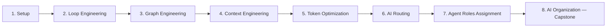

# The AI Agents Mastery Roadmap

*Full phase guides live in `phases/`. This file is the map: sequence, master resource index, timeline.*

---

# 1. Orientation: Why This Sequence Works

This roadmap has eight phases, and they are a ladder, not a menu: **Setup → Loop Engineering → Graph Engineering → Context Engineering → Token Optimization → AI Routing → Agent Roles Assignment → AI Organization (capstone)**. Each phase assumes the one before it works. Skipping a rung doesn't save time — it just moves the debugging to a later, more expensive phase.

The **agent loop** is the atomic unit of everything you'll build. An agent is, at its core, a `while` loop: the LLM receives a goal plus accumulated context, emits reasoning and either a final answer or a tool call, your code executes the tool, the observation is appended to context, and the cycle repeats. Every later structure — supervisor topologies, deep-research agents, org-chart hierarchies — is a composition of loops. If you reach for a framework before you can write that loop in raw Python, you'll end up debugging abstractions (executors, graph nodes) with no mental model of what sits underneath. So the loop comes first, built by hand.

**Graph engineering** comes second because a graph is the loop made explicit, controllable, and persistent. Once you've felt the failure modes of an implicit loop — no termination control, hidden state, no way to inspect a run mid-flight — the value proposition of a framework like LangGraph ("make the loop a state machine you can checkpoint and rewind") clicks instantly. **Context engineering** and **token optimization** follow as a pair because both are context-window skills, and they must be solid before you go multi-agent. Context engineering is the pivot of the whole curriculum: every token technique is a manipulation of the context window (caching keeps the prefix stable, compaction decides what to evict), and multi-agent architectures are, at heart, a context-isolation strategy. You can't appreciate compaction or context rot until you've personally watched an agent degrade around step 15 of a long loop — so these phases land after you've built things, and before you multiply them.

**Routing** is the gateway to multi-agent systems: supervisor, handoff, and swarm patterns are all just routing decisions over time. It also happens to be where quality, latency, and unit economics meet for your SaaS ERP, so it earns an extended treatment. **Role assignment** then teaches you to decompose a problem into non-overlapping, verifiable agent roles — the first design skill unique to multi-agent work. The **AI Organization** capstone comes last for a simple reason: org scale multiplies every lower-layer weakness. A shaky loop becomes twenty shaky loops; a bloated context becomes a bloated context per agent per step. Fix the layers bottom-up, then multiply.

## How to Use This Roadmap: The Build-Gate Method

Every phase ends with a hands-on project, and you do not advance until it works. This is deliberate: the consistent advice across every source in this roadmap is that rebuilding from scratch beats consuming courses. Build the naive version first, feel where it hurts, then let the framework earn its place. A gate is "working" when you can run it end to end, explain each moving part, and break it on purpose and recover.

The second rule is restraint. The 2025–2026 consensus — articulated in Anthropic's *Building effective agents* (https://www.anthropic.com/engineering/building-effective-agents) and echoed by the 12-Factor Agents manifesto (https://github.com/humanlayer/12-factor-agents) — is **workflow first, agents only when necessary**. A well-prompted single LLM call beats a workflow; a deterministic workflow beats an agent; one agent with good tools usually beats a crew. Complexity must earn its place. This matters most as you approach the capstone: the difference between a working AI organization and an expensive demo is usually the discipline to have *fewer* agents, each with a crisp job. Knowing when NOT to add an agent is a core skill this roadmap tests at every gate.

## Prerequisites

Before Phase 1, you should be comfortable with four things:

- **Python** — functions, async basics, decorators, virtual environments, type hints (ideally Pydantic).
- **Calling an LLM API** — chat completions, streaming, structured output, and one provider API key.
- **Basic prompt engineering** — you can write and iterate on a system prompt and understand tool/function calling.
- **Git** — clone, branch, commit; every phase project lives in its own repo.

If you want a structured refresher that builds agentic patterns from first principles in raw Python, DeepLearning.AI's *Agentic AI* course (https://www.deeplearning.ai/courses/agentic-ai) covers reflection, tool use, planning, and multi-agent patterns. Read Anthropic's *Building effective agents* (linked above) before writing any agent code — it is the canonical taxonomy this whole roadmap follows.

## Time Expectation

Plan for roughly **24 weeks at 5–8 hours per week**. Most phases take two to three weeks; routing and the capstone take longer. The schedule is adjustable — the gates are not. If a phase takes an extra week because your mini-project has a bug you can't yet explain, that week is the curriculum working as intended. Speed is not the metric; a working build you understand is.

Ready? Phase 1 gets your environment and first raw-Python loop running.

---

# 10. Appendix — Master Resource Index & 24-Week Timeline

Pure reference material. Every link below comes from the phase research files and was verified there (search result, opened page, or oEmbed/HTTP check). Each resource is listed once, at the phase where it fits best.

## 10.1 Who to Follow on X — The Consolidated List

| Handle | URL | Why follow | Most relevant phase |
|---|---|---|---|
| @hwchase17 | https://x.com/hwchase17 | LangChain/LangGraph founder & CEO; framework releases, agent architecture, context engineering takes | Phase 1 |
| @AnthropicAI | https://x.com/AnthropicAI | Agent SDK / Claude Code releases, MCP news, engineering blog links (research also suggests @claudeai for product-side updates; no direct URL captured) | Phase 1 |
| @OfficialLoganK | https://x.com/OfficialLoganK | Leads Google AI Studio/Gemini API (ex-OpenAI DevRel); insider view of agent tooling shifts | Phase 1 |
| @steipete | https://x.com/steipete | Open-source agentic builder (OpenClaw, now at OpenAI); candid agentic-engineering workflows | Phase 1 |
| @OpenRouterAI | https://x.com/OpenRouterAI | Model catalog, auto-router, provider routing, fallback features | Phase 6 |
| @jamescalam | https://x.com/jamescalam | Aurelio AI founder; creator of the `semantic-router` library | Phase 6 |
| @shao__meng | https://x.com/shao__meng/status/1811187309116895402 | Canonical Mixture-of-Models (MoM) routing explainer thread | Phase 6 |
| @dexhorthy | https://x.com/dexhorthy | HumanLayer founder; 12-Factor Agents; loop guards, compaction, RPI loops | Phase 2 |
| @ShunyuYao12 | https://x.com/ShunyuYao12 | Author of ReAct; co-author of Reflexion, Tree of Thoughts, SWE-bench | Phase 2 |
| @lilianweng | https://x.com/lilianweng | Author of the canonical "LLM Powered Autonomous Agents" survey | Phase 2 |
| @swyx | https://x.com/swyx | Latent Space editor; "AI Engineer" movement; meta-feed for agent discourse | Phase 2 |
| @AndrewYNg | https://x.com/AndrewYNg | DeepLearning.AI course announcements; frames agent design patterns for learners | Phase 2 |
| @LangChainAI | https://x.com/LangChainAI | Official announcements: LangGraph 1.0, Studio, Academy courses | Phase 3 |
| @RLanceMartin | https://x.com/RLanceMartin | LangChain engineer; LangGraph course lead; Write/Select/Compress/Isolate context taxonomy | Phase 4 |
| @BraceSproul | https://x.com/BraceSproul | LangChain engineer; LangGraph-adjacent OSS, agent frontends | Phase 3 |
| @karpathy | https://x.com/karpathy | Coined the canonical "context engineering" definition; LLM-as-OS mental model | Phase 4 |
| @tobi | https://x.com/tobi | Shopify CEO; made "context engineering" mainstream | Phase 4 |
| @_philschmid | https://x.com/_philschmid | Google DeepMind; practical context-engineering threads | Phase 4 |
| @trq212 | https://x.com/trq212 | Claude Code team; "Prompt Caching Is Everything" thread — primary source on token economics | Phase 5 |
| @bcherny | https://x.com/bcherny | Creator/head of Claude Code; context/token-efficiency setup threads | Phase 5 |
| @simonw | https://x.com/simonw | Independent researcher; annotated the caching lessons; relentless practical LLM experiments | Phase 5 |
| @nummanali | https://x.com/nummanali/status/2010042788566720955 | Viral compaction-survival workflow (Plan Mode + persistent to-do list) | Phase 5 |
| @joaomdmoura | https://x.com/joaomdmoura | CrewAI founder/CEO; role/delegation design, enterprise multi-agent case studies | Phase 7 |
| @crewAIInc | https://x.com/crewAIInc | Official CrewAI account; releases, example crews, hierarchical processes | Phase 7 |
| @pyautogen | https://x.com/pyautogen | Official AutoGen account; GroupChat patterns; Agent Framework migration news | Phase 7 |
| @omarsar0 | https://x.com/omarsar0 | DAIR.AI founder; "AI Agents Weekly"; orchestration paper curation | Phase 7 |
| @yoheinakajima | https://x.com/yoheinakajima | BabyAGI creator; 120+ public agent builds; the autonomous-business mindset | Phase 8 |
| @MetaGPT_ | https://x.com/MetaGPT_ | Official MetaGPT account; multi-agent SOP workflow demos and research | Phase 8 |
| @cognition_labs | https://x.com/cognition_labs | Makers of Devin; org-scale multi-agent lessons ("Devin can now manage Devins") | Phase 8 |

## 10.2 YouTube Channels Worth Subscribing To

| Channel | Best for |
|---|---|
| freeCodeCamp.org | Long-form free courses (the 3-hour LangGraph course) |
| LangChain | Official LangGraph/handoffs/context-engineering videos and Academy intros |
| Anthropic | Official agent-building guidance ("Vibe coding in prod", "Tips for building AI agents") |
| OpenAI | "Advice for Building Agents" and SDK guidance |
| DeepLearning.AI | Andrew Ng's agentic-design-pattern courses and talks |
| IBM Technology | Vendor-neutral multi-agent and prompt-caching explainers |
| Krish Naik | Long crash courses: LangGraph + MCP, CrewAI, AutoGen (see 10.5 for unlinked titles) |
| Matthew Berman | Agent-framework walkthroughs (MetaGPT) and agent evaluation |
| Dave Ebbelaar | Building agents in pure Python before frameworks |
| James Briggs | Semantic routing and the Aurelio `semantic-router` course playlist |
| Tech With Tim | Production-style LangGraph agent builds with live search |
| CodingDeft | Short, current CrewAI tutorials with YAML project layout |
| Sam Witteveen | Code-level teardowns (BabyAGI, Magentic-One) |
| Sequoia Capital | Andrew Ng's classic "AI agentic workflows" talk |
| Latent Space | Podcast deep dives (Lance Martin on context engineering) |
| YC Root Access | Dex Horthy's advanced context engineering talk |
| Simplilearn | Beginner CrewAI workflow tutorials |
| Probably Private | RouteLLM cost-routing walkthroughs |
| Nate Herk \| AI Automation | Claude/Claude Code token-saving habits |
| Tyler AI | ChatDev virtual-software-company builds |

## 10.3 The Docs Library

| Resource | URL | What it's for | Phase |
|---|---|---|---|
| Anthropic — "Building effective agents" | https://www.anthropic.com/engineering/building-effective-agents | THE canonical taxonomy: workflows vs. agents, five workflow patterns, "simplest solution first" | 1 |
| Anthropic — "How we built our multi-agent research system" | https://www.anthropic.com/engineering/multi-agent-research-system | Production lessons on orchestrator-worker design | 8 |
| Microsoft — AI Agents for Beginners | https://github.com/microsoft/ai-agents-for-beginners | Free 18-lesson structured curriculum (patterns, tools, RAG, MCP, production) | 1 |
| OpenAI — "A practical guide to building agents" | https://openai.com/business/guides-and-resources/a-practical-guide-to-building-ai-agents/ | Single- vs. multi-agent decisions, guardrails, orchestration | 1 |
| OpenAI Agents SDK docs + repo | https://openai.github.io/openai-agents-python/ · https://github.com/openai/openai-agents-python | Agents, Runner, handoffs, guardrails, built-in agent loop; quickstart source | 1 |
| MCP introduction + GitHub org | https://modelcontextprotocol.io/introduction · https://github.com/modelcontextprotocol | Protocol spec, SDKs, reference servers | 1 |
| ReAct paper + code | https://arxiv.org/abs/2210.03629 · https://github.com/ysymyth/ReAct | The paper behind the agent loop | 2 |
| Reflexion paper | https://arxiv.org/abs/2303.11366 | Verbal reinforcement learning / self-correction loops | 2 |
| Lilian Weng — "LLM Powered Autonomous Agents" | https://lilianweng.github.io/posts/2023-06-23-agent/ | Definitive survey: planning, memory, tool use | 2 |
| 12-Factor Agents (HumanLayer) | https://github.com/humanlayer/12-factor-agents | Own your control flow and context; the anti-framework manifesto | 2 |
| LangChain Academy — Intro to LangGraph | https://academy.langchain.com/courses/intro-to-langgraph | Free 55-lesson official course (graph → memory → breakpoints → deployment) | 3 |
| LangGraph docs + repo | https://docs.langchain.com/oss/python/langgraph/overview · https://github.com/langchain-ai/langgraph | Graph API, persistence, HITL, subgraphs, time travel (v1.0 era) | 3 |
| LangChain multi-agent docs | https://docs.langchain.com/oss/python/langchain/multi-agent | Router vs. handoffs vs. subagents decision table | 6 |
| RouteLLM repo + paper | https://github.com/lm-sys/routellm · https://arxiv.org/abs/2406.18665 | Cost-aware model routing with threshold calibration | 6 |
| Aurelio Semantic Router | https://github.com/aurelio-labs/semantic-router | Fast embedding-based intent routing (~100ms) | 6 |
| Lance Martin — "Context Engineering for Agents" | https://rlancemartin.github.io/2025/06/23/context_engineering/ | Original Write/Select/Compress/Isolate taxonomy | 4 |
| Manus — "Context Engineering for AI Agents" | https://manus.im/blog/Context-Engineering-for-AI-Agents-Lessons-from-Building-Manus | Production lessons: KV-cache hit rate, tool masking, recitation | 4 |
| Anthropic — "Effective context engineering for AI agents" | https://www.anthropic.com/engineering/effective-context-engineering-for-ai-agents | Attention budget, compaction, sub-agent architectures | 4 |
| Chroma — "Context Rot" | https://research.trychroma.com/context-rot | 18-model empirical study of degradation with input length | 4 |
| Anthropic prompt caching docs | https://docs.anthropic.com/en/docs/build-with-claude/prompt-caching | cache_control, breakpoints, TTLs, pricing | 5 |
| OpenAI + Gemini caching docs | https://developers.openai.com/api/docs/guides/prompt-caching · https://developers.openai.com/cookbook/examples/prompt_caching_201 · https://ai.google.dev/gemini-api/docs/caching | Automatic caching and prompt_cache_key (OpenAI); implicit vs. explicit caching (Gemini) | 5 |
| CrewAI docs | https://docs.crewai.com/ (role design: https://docs.crewai.com/v1.15.2/en/guides/agents/crafting-effective-agents) | role/goal/backstory, hierarchical processes, guardrails | 7 |
| DeepLearning.AI — Multi AI Agent Systems with crewAI | https://www.deeplearning.ai/courses/multi-ai-agent-systems-with-crewai | The canonical role-based design course (João Moura) | 7 |
| AutoGen repo (maintenance mode → Microsoft Agent Framework) | https://github.com/microsoft/autogen | Conversation-first multi-agent patterns; learn concepts, check migration status | 7 |
| BabyAGI repo | https://github.com/yoheinakajima/babyagi | The ~140-line task-driven autonomous agent | 8 |
| ChatDev repo | https://github.com/OpenBMB/ChatDev | Virtual software company; chat chains and dehallucination | 8 |
| MetaGPT repo | https://github.com/FoundationAgents/MetaGPT | SOP-encoded AI software company (PRD → design → code → QA) | 8 |
| OpenAI Swarm repo (educational; superseded by Agents SDK) | https://github.com/openai/swarm | Read it to learn the handoff pattern, not to deploy it | 8 |
| Langfuse agent observability guide | https://langfuse.com/blog/2024-07-ai-agent-observability-with-langfuse | Distributed tracing across multi-agent org runs | 8 |
| Cognition blog | https://cognition.com/blog | "What's actually working" in multi-agent systems at org scale | 8 |

## 10.4 Suggested 24-Week Timeline

Adjustable: compress by overlapping video watching with build weeks, or extend any phase whose build gate isn't passing. Do not advance past a gate until the mini-project works.

| Weeks | Phase | Focus | Build gate |
|---|---|---|---|
| 1–3 | 1. Setting Up AI Agents | LLM APIs, tool calling, the agent loop from scratch, LangGraph intro, MCP | "Pocket Research Agent" built three ways: raw Python → LangGraph → MCP server |
| 4–6 | 2. Loop Engineering | ReAct, loop guards, retry/self-correction, reflection, evaluator-optimizer | "From ReAct to Reflection in ~100 lines" — one file with guards and a failure write-up |
| 7–9 | 3. Graph Engineering | StateGraph primitives, reducers, conditional edges, checkpointers, HITL, subgraphs | "Support Triage Agent" with approval gate, crash-resume, and time travel |
| 10–12 | 4. Context Engineering | Write/Select/Compress/Isolate, memory architecture, KV-cache awareness | "The Context Gauntlet": naive vs. engineered agent with accuracy-vs-context-length curves |
| 13–14 | 5. Token Optimization | Prompt caching, compaction, truncation, model right-sizing, batch APIs | "Cut My Agent's Token Bill in Half": ≥50% cost reduction with ≤2-point quality drop |
| 15–17 | 6. AI Routing | Semantic/intent routing, rule-based routing, RouteLLM cost routing, handoffs | "ERP Query Router": intent router + supervisor + per-step model routing with logged decisions |
| 18–19 | 7. Agent Roles Assignment | Role vocabulary, CrewAI role/goal/backstory, delegation, supervisor topologies | "Planner → Executor → Reviewer" crew with a working rejection loop |
| 20–24 | 8. Building Your AI Organization (capstone) | Org hierarchies, task boards, approval gates, observability, evals, budgets | "Mini ERP, Inc.": 3-tier agent org with task board, 2 human gates, Langfuse traces, eval harness, kill-switch |

## 10.5 Unverified Links — Search YouTube for These Titles

Verified to exist (via Class Central listings and research notes) but no direct watch URL could be captured. Search YouTube for:

- **"Agentic AI with LangGraph and MCP Crash Course – Part 1"** — Krish Naik (and Part 2: debugging/monitoring with LangGraph Studio + LangSmith)
- **"The Ultimate MCP Crash Course – Build From Scratch"** — Web Dev Simplified
- **"Build an AI Agent from Scratch in Raw Python"** — AI Bites
- **"Build a Reflection AI Agent from Scratch — Raw Python Implementation"** — AI Bites
- **"Tutorial 1: Getting Started With LangGraph — Building Stateful Multi AI Agents"** (and the "Agentic AI With LangGraph" playlist) — Krish Naik
- **"How to Build a Stock Screener AGENT with LangGraph in 30 Minutes"** — Nicholas Renotte

**Deprecation notes from cross-verification:** AutoGen is in maintenance mode and migrating to Microsoft Agent Framework — learn its concepts, but build new work elsewhere. OpenAI Swarm is deprecated in favor of the OpenAI Agents SDK. Dropped items (do not search for): the IBM Technology context-engineering explainer (URL unverifiable) and "Cut LLM Token Costs by 60% Using TOON" (unverifiable).
